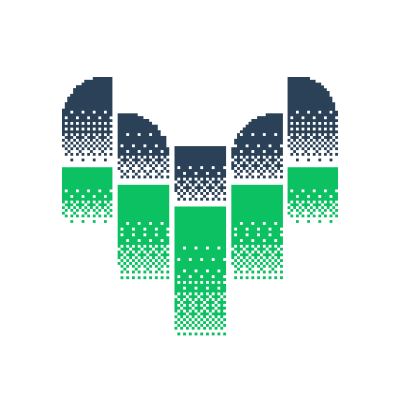

# This repository contains logos of my public projects.

### [@ukorvl/react-on-screen](https://github.com/ukorvl/react-on-screen)

<picture>
  <source media="(prefers-color-scheme: dark)" srcset="./react-on-screen/react-on-screen-dark.svg"/>
  
</picture>

### [lightweight-charts-react-components](https://github.com/ukorvl/lightweight-charts-react-components)

### [lightweight-charts-vue](https://github.com/ukorvl/lightweight-charts-vue)

